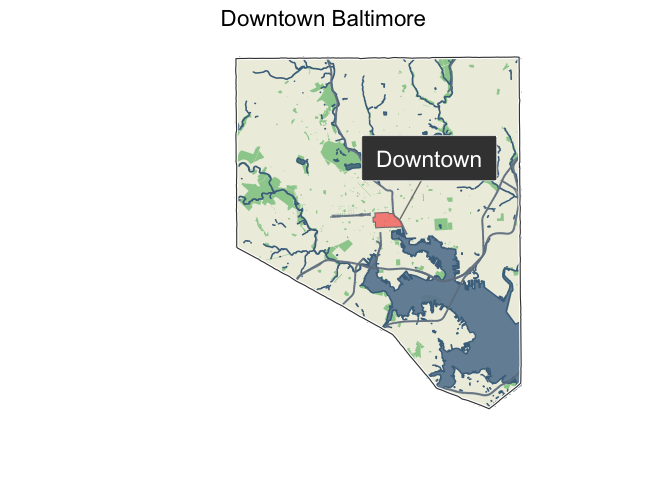
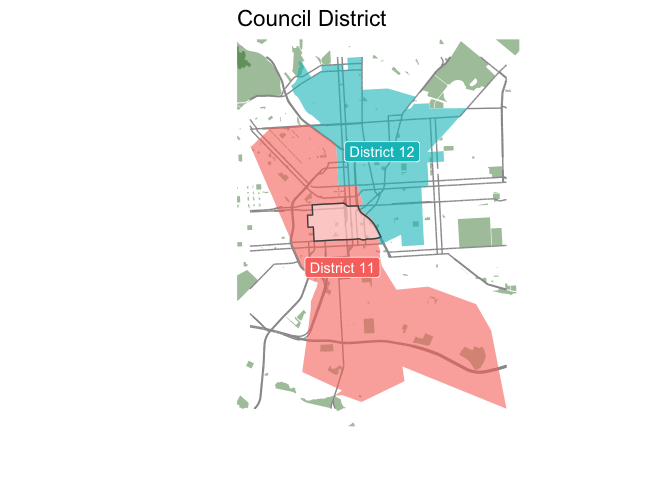
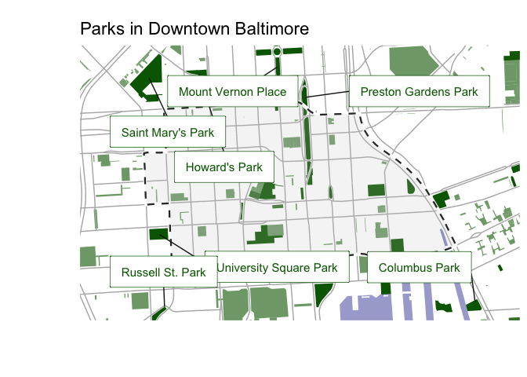
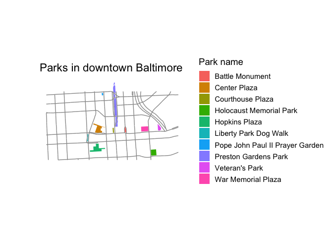
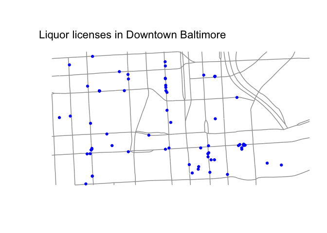

<!-- README.md is generated from README.Rmd. Please edit that file -->

# mapbaltimore 

<!-- badges: start -->

[](https://lifecycle.r-lib.org/articles/stages.html#experimental)
<!-- badges: end -->

The goal of the mapbaltimore package is to provide an easy way to create
maps of Baltimore neighborhoods, Council districts, and other areas
using open data on schools, housing, parks, and public transit.

## Installation

You can install this development version from
[GitHub](https://github.com/) with:

``` r
# install.packages("devtools")
remotes::install_github("elipousson/mapbaltimore")
```

## Examples

``` r
library(sf)
#> Linking to GEOS 3.9.1, GDAL 3.4.2, PROJ 8.2.1; sf_use_s2() is TRUE
library(ggplot2)
library(mapbaltimore)

set_map_theme()
```

Less experienced R users may find the mapbaltimore package most useful
for the convenient function you can use to quickly create maps of
Baltimore neighborhoods.

For example, these maps show Downtown Baltimore in the context of the
full city boundary and the local City Council district. Of course, the
underlying open data can sometimes be a little unpredictable. In this
case, the boundaries of the downtown neighborhood just *slightly*
overlap with District 12 so this may be an error.

``` r
downtown <- get_area(type = "neighborhood",
                     area_name = "Downtown")

map_area_in_city(area = downtown) +
  labs(title = "Downtown Baltimore")
```



``` r
map_area_in_areas(area = downtown,
                  type = "council district",
                  show_label = TRUE)
```



The mapping functions rely on a general data function (`get_area_data`)
to return selected data within and around an area. More experienced R
users may prefer to use these functions directly for more direct control
over the appearance of a map or to access the data for analysis.

For example, compare the map created by the `map_area_parks` function to
a simple custom map made using data retrieved using the `get_area_data`
function and streets from the
[`get_area_streets`](https://elipousson.github.io/mapbaltimore/reference/get_area_streets.html)
function. `get_area_streets` wraps the `get_area_data` function and
offers the option to filter streets by functional classification.

``` r
map_area_parks(area = downtown) +
  labs(title = "Parks in Downtown Baltimore")
#> Reading layer `unimproved_property' from data source 
#>   `/private/var/folders/3f/50m42dx1333_dfqb5772j6_40000gn/T/Rtmp9UOCbt/temp_libpath17b7df70a9e5/mapbaltimore/extdata/unimproved_property.gpkg' 
#>   using driver `GPKG'
#> Simple feature collection with 526 features and 64 fields
#> Geometry type: MULTIPOLYGON
#> Dimension:     XY
#> Bounding box:  xmin: 431755 ymin: 179395.1 xmax: 434669.5 ymax: 181385.7
#> Projected CRS: NAD83(HARN) / Maryland
```



``` r
downtown_parks <- get_area_data(data = parks,
                                area = downtown,
                                crop = FALSE,
                                trim = FALSE)

downtown_streets <- get_area_streets(area = downtown,
                                     sha_class = c("PART", "MART", "INT"))

ggplot() +
  geom_sf(data = downtown_streets, color = "gray60") +
  geom_sf(data = downtown_parks, aes(fill = name), color = NA) +
  labs(title = "Parks in downtown Baltimore",
       fill = "Park name")
```



*Please note:* the real property data that was previously included with
this package has been removed because loading the full dataset into
memory was causing major performance problems. I’m developing a new
function to download, process, and cache these larger data sets but,
until this is complete, none of the functions related to real property
data will work.

If you need data that is not included with the package, mapbaltimore
includes several functions for accessing remote data including
[`get_area_osm_data`](https://elipousson.github.io/mapbaltimore/reference/get_osm_feature.html)
and
[`get_area_esri_data`](https://elipousson.github.io/mapbaltimore/reference/get_area_esri_data.html).
These functions are largely wrappers for other packages with
`get_osm_features` using the rOpenSci
[osmdata](https://github.com/ropensci/osmdata) package,
`get_area_esri_data` using the
[esri2sf](https://github.com/yonghah/esri2sf) package, and
`get_maryland_open_resources` using the
[RSocrata](https://github.com/Chicago/RSocrata) package. For example,
see this map of liquor licenses for downtown using one of the (still
limited) number of remote data sources supported by
`get_area_esri_data`:

``` r
liquor_licenses <- get_area_esri_data(area = downtown,
                                    type = "liquor licenses",
                                    trim = TRUE)
#> ✔ Downloading "Liquor_Licenses" from
#>   <https://opendata.baltimorecity.gov/egis/rest/services/Hosted/Liquor_Licenses/FeatureServer/0/>
#> Layer type: "Feature Layer"
#> 
#> Geometry type: "esriGeometryPoint"
#> 
#> Service Coordinate Reference System: "EPSG:3857"
#> 
#> Output Coordinate Reference System: "EPSG:4326"
#> Warning: attribute variables are assumed to be spatially constant throughout all
#> geometries

ggplot() +
  geom_sf(data = downtown_streets, color = "gray60") +
  geom_sf(data = liquor_licenses, color = "blue") +
  labs(title = "Liquor licenses in Downtown Baltimore")
```



## Ongoing development

Overall, this package is definitely experimental and I’m changing
functions on a regular basis so use with caution. Here are a few of the
ideas I’m hoping to add to this package:

-   making map functions work as layers (more similar to
    [snapbox](https://github.com/anthonynorth/snapbox) or
    [ggspatial](https://github.com/paleolimbot/ggspatial))
-   labeled data using the [labelled
    package](https://github.com/larmarange/labelled) (many city data
    sources have limited or inaccessible documentation)
-   [gt](https://gt.rstudio.com/) tables to display property
    characteristics by neighborhood
-   functions for working with [VitalSigns
    data](https://bniajfi.org/vital_signs/) from the Baltimore
    Neighborhood Indicators Alliance
-   additional historic spatial and demographic datasets

Suggestions and feature requests are welcome!

## Related and inspirational packages

The development of mapbaltimore was inspired in part by a handful of
other “place-based” R packages that I’ve seen over the past few months
such as [nycgeo](https://nycgeo.mattherman.info/index.html) for New York
City and [gateway](https://github.com/slu-openGIS/gateway) for Saint
Louis.

At the national level, [tigris](https://github.com/walkerke/tigris)
provides access to boundary data for all geographies used by the U.S.
Census Bureau. mapbaltimore uses tigris to download all of the U.S.
Census geographies that are included with the package. Outside the U.S.,
there are similar packages that provide access to varied boundary data
for Brazil [geobr](https://github.com/ipeaGIT/geobr), Uruguay
‘[geouy](https://github.com/RichDeto/geouy)’, Chile
‘[chilemapas](https://github.com/pachamaltese/chilemapas)’ and Mexico
‘[mxmaps](https://github.com/diegovalle/mxmaps)’.
