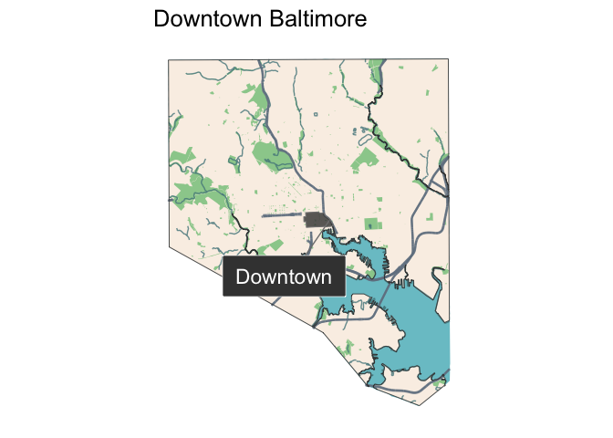
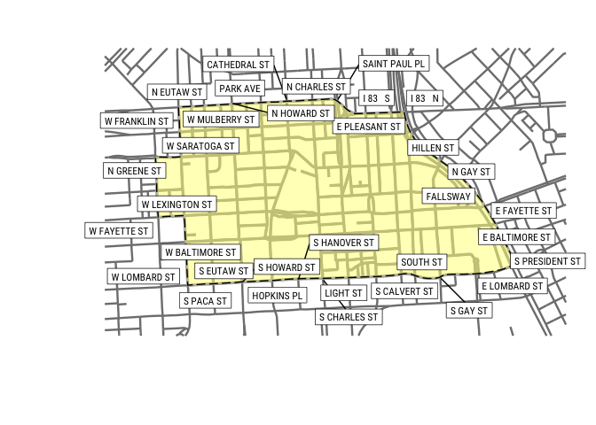
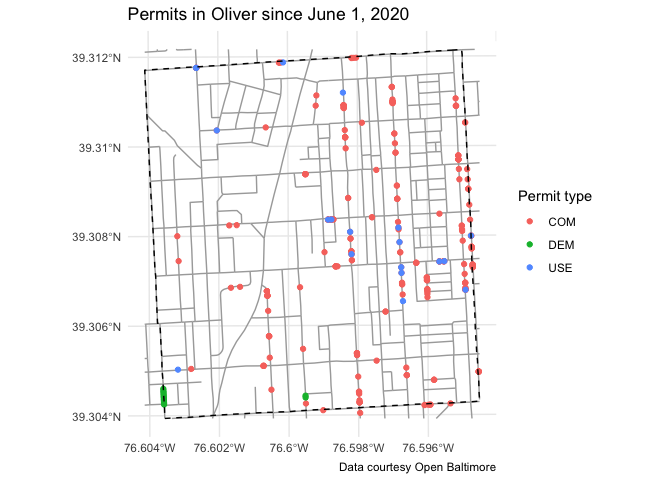

# mapbaltimore

<!-- badges: start -->
<!-- badges: end -->

The goal of the mapbaltimore package is to provide an easy way to create
maps of Baltimore neighborhoods using open data on demographics,
transportation, housing, and public safety.

## Installation

You can install this development version from
[GitHub](https://github.com/) with:

``` r
# install.packages("devtools")
devtools::install_github("elipousson/mapbaltimore")
```

## Examples

The mapbaltimore package includes utility functions to a neighborhood or
other area type and mapping functions to create common styles of
planning maps such as a context map for downtown Baltimore.

``` r
library(sf)
```

    ## Linking to GEOS 3.8.1, GDAL 3.1.4, PROJ 6.3.1

``` r
library(mapbaltimore)

downtown <- get_area(type = "neighborhood",
                     area_name = "Downtown")

map_area_in_city(area = downtown,
                 map_title = "Downtown Baltimore")
```

<!-- -->

``` r
map_area_streetnames(area = downtown,
                     label_location = "edge")
```

<!-- -->

The mapbaltimore package also includes functions to get data from the
Open Baltimore data portal and commonly datasets including the street
center line data used in this map of building permits in the Oliver
neighborhood in East Baltimore.

``` r
neighborhood <- get_area(type = "neighborhood",
                         area_name = "Oliver")

permits <- get_permits(area = neighborhood,
                       start_date = "2020-06-01",
                       end_date = "2020-12-01",
                       geometry = TRUE)

neighborhood_streets <- sf::st_crop(streets, neighborhood)

library(ggplot2)

ggplot() +
  geom_sf(data = neighborhood_streets,
          color = "darkgray") +
  geom_sf(data = permits,
          aes(color = permit_type)) +
    geom_sf(data = neighborhood,
          fill = NA,
          color = "black",
          linetype = "dashed") +
  theme_minimal() +
  labs(
    title = paste0("Permits in ", neighborhood$name, " since June 1, 2020"),
    caption = "Data courtesy Open Baltimore",
    color = "Permit type"
  )
```

<!-- -->
