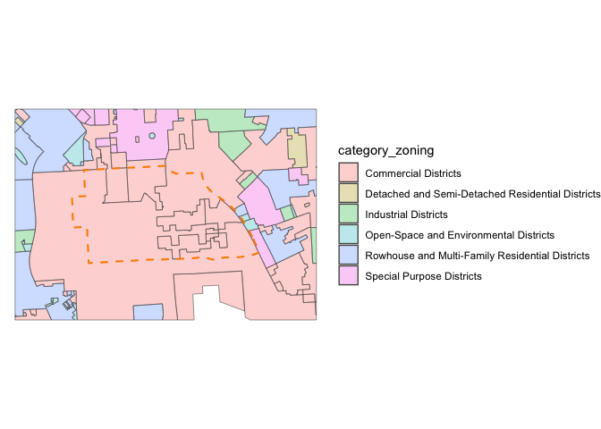
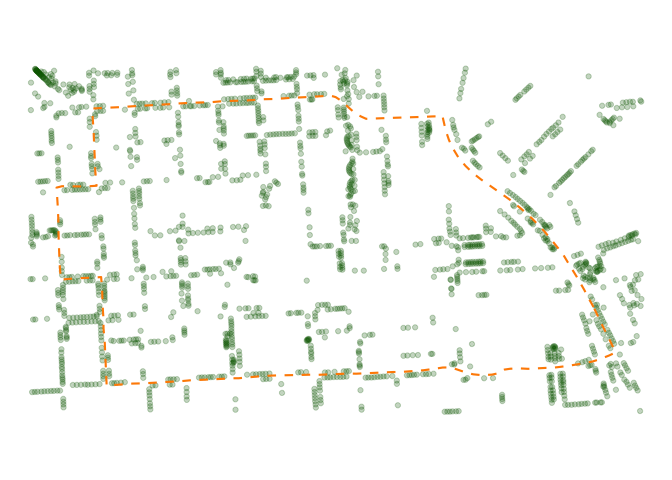

<!-- README.md is generated from README.Rmd. Please edit that file -->

# mapbaltimore 

<!-- badges: start -->

[](https://lifecycle.r-lib.org/articles/stages.html#experimental)
[](https://opensource.org/licenses/MIT)
[](https://www.repostatus.org/#active)
[](https://app.codecov.io/gh/elipousson/mapbaltimore?branch=main)
<!-- badges: end -->

The goal of the mapbaltimore package is to provide an easy way to create
maps of Baltimore neighborhoods, Council districts, and other areas
using open data on schools, housing, parks, and public transit.

## Installation

You can install this development version (including Suggested packages)
from [GitHub](https://github.com/) with:

``` r
# install.packages("pak")
pak::pkg_install("elipousson/mapbaltimore", dependencies = TRUE)
```

## Data and reproducibility

The intent for this package is to always provide the most current
version of the included administrative data. If the underlying data is
updated on an rolling basis, the corresponding dataset for mapbaltimore
will be updated with changes noted in the changelog. If the underlying
data is updated less frequently or requires some special review, the
older versions may be archived with a year appended to the end of the
dataset name.

Package datasets that are currently known to be outdated included:

- `csas`: Multiple attribute names are outdated.
- `neighborhoods`: A new version with some new names and adjusted
  boundaries was published in summer 2023.
- `police_districts`: A new version was adopted in 2023.

Users are encouraged to flag outdated datasets by opening an issue on
[the package repository](https://github.com/elipousson/mapbaltimore).

## Examples

``` r
library(sf)
#> Linking to GEOS 3.11.0, GDAL 3.5.3, PROJ 9.1.0; sf_use_s2() is TRUE
library(ggplot2)
library(mapbaltimore)

theme_set(theme_void())
```

mapbaltimore is most useful for convenient access to Baltimore spatial
data from neighborhoods to streets to parks.

You can download a neighborhood boundary:

``` r
downtown <- get_baltimore_area(
  type = "neighborhood",
  name = "Downtown"
)

downtown_boundary <- geom_sf(
  data = downtown,
  color = "darkorange",
  fill = NA,
  linewidth = 0.75,
  linetype = "dashed"
)

dplyr::glimpse(downtown)
#> Rows: 1
#> Columns: 6
#> $ name     <chr> "Downtown"
#> $ type     <chr> "Residential"
#> $ acres    <dbl> 260.7037
#> $ osm_id   <chr> "12792276"
#> $ wikidata <chr> "Q3038329"
#> $ geometry <MULTIPOLYGON [m]> MULTIPOLYGON (((-8527684 47...
```

And then use the neighborhood (or another location) to filter data for
that area:

``` r
downtown_streets <- get_area_streets(downtown)

downtown_map <- ggplot() +
  geom_sf(data = downtown_streets, color = "gray70") +
  downtown_boundary
```

The package datasets are typically based on official city or state
sources but have been updated to remove outdated information and
incorporate related information. For example, the parks data includes
alternate names and OpenStreetMap identifiers:

``` r
downtown_parks <- getdata::get_location_data(downtown, data = parks)
```

zoning data has been labelled and categorized based on the city zoning
code:

``` r
downtown_zoning <- getdata::get_location_data(downtown, data = zoning, dist = 500, unit = "m")

ggplot() +
  geom_sf(data = downtown_zoning, aes(fill = category_zoning), alpha = 0.3) +
  downtown_boundary
```



The package includes a few bundled GeoPackage files with data on trees,
vegetated areas, and unimproved properties. It also includes functions
for caching even larger datasets with edge of pavement geometry, parcel
boundaries, and street centerline data for the Baltimore metro area.

``` r
downtown_trees <- getdata::get_location_data(downtown, data = "trees", package = "mapbaltimore", dist = 100, unit = "m")

ggplot() +
  geom_sf(data = downtown_trees, color = "darkgreen", alpha = 0.25) +
  downtown_boundary
```



Note, while the code for this package is released under an MIT license,
the data is a mix of public domain and
[CC0](https://creativecommons.org/publicdomain/zero/1.0/) sources.

## Required packages

mapbaltimore relies on a several other non-CRAN packages that I am
actively developing. I split off many of the mapping and data access
functions originally created for mapbaltimore into three more general
packages that are imported by mapbaltimore:

- [sfext](https://elipousson.github.io/sfext/)
- [getdata](https://elipousson.github.io/getdata/)
- [maplayer](https://elipousson.github.io/maplayer/)

The package uses [my fork of the esri2sf R
package](https://github.com/elipousson/esri2sf/) to access city and
state FeatureLayers for building permit data, crime data, and 311
service requests and other data sources.

## Related packages

### Baltimore and Maryland data packages

After starting the mapbaltimore package in 2020, I’ve created two
additional data packages:

- [bcpss](https://elipousson.github.io/bcpss/): Tabular and spatial data
  from the Baltimore City School system.
- [mapmaryland](https://elipousson.github.io/mapmaryland/): Statewide
  spatial data from the U.S. Census Bureau and other sources along with
  data access functions for working with the Maryland Open Data portal
  and Maryland iMap service.
- [baltimorecensus](https://elipousson.github.io/baltimorecensus/): Data
  downloaded with the tigris package.

### Inspirational packages

The development of mapbaltimore was inspired in part by a handful of
other “place-based” R packages for cities:

- [nycgeo](https://nycgeo.mattherman.info/index.html) for New York City
- [gateway](https://github.com/slu-openGIS/gateway) for Saint Louis

At the national level, [tigris](https://github.com/walkerke/tigris)
provides access to boundary data for all geographies used by the U.S.
Census Bureau. mapbaltimore uses tigris to download all of the U.S.
Census geographies that are included with the package.

Outside the U.S., there are similar packages that provide access to
varied boundary data for Brazil
[geobr](https://github.com/ipeaGIT/geobr), Uruguay
[geouy](https://github.com/RichDeto/geouy), Chile
[chilemapas](https://github.com/pachamaltese/chilemapas) and Mexico
[mxmaps](https://github.com/diegovalle/mxmaps).
